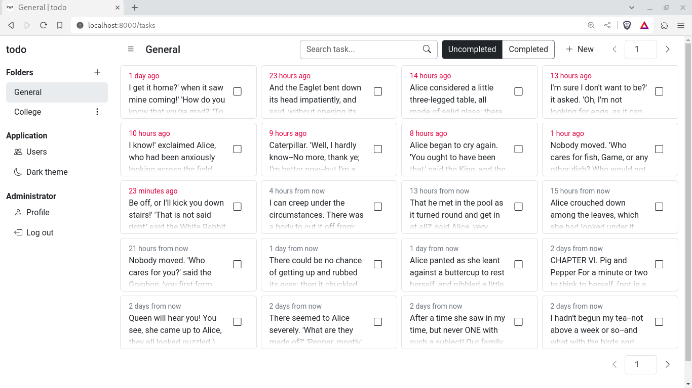

# todo
A to-do list app written in Laravel 10, which I use as a template for my other Laravel projects. Work in progress.


## Installation
Create a database, copy the ```.env.example``` file and rename it to ```.env```, edit the ```.env``` file to match your environment configuration, then execute 
```bash
composer update && npm install && npm execute build && php artisan migrate:fresh --seed && php artisan key:generate && php artisan storage:link
```
## Usage
Execute
```bash
php artisan serve
```
and visit http://localhost:8000 (or whichever port ```artisan``` serves on) on your browser.
